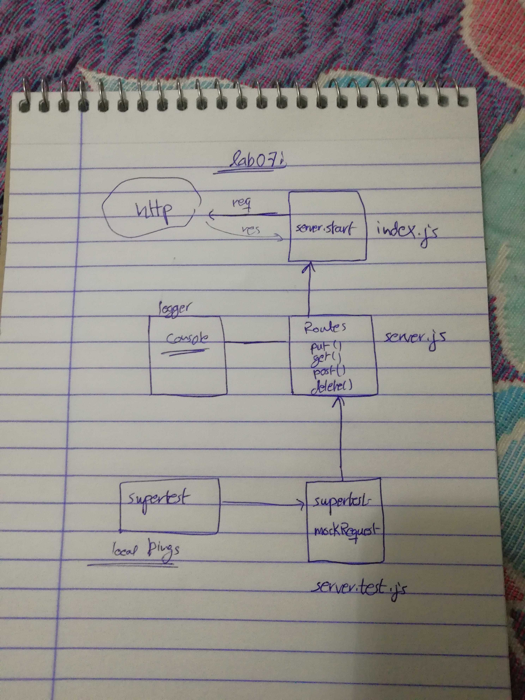

# LAB - Class 07

## Project Name
API-Server

### Author: Mohammed Alhawamdeh

### Links and Resources

- [submission PR](https://github.com/Mohammed-401-advanced-javascript/lab-07-api-server/pull/1)
- [ci/cd](https://github.com/Mohammed-401-advanced-javascript/lab-07-api-server/actions) (GitHub Actions)
- [back-end server url](http://xyz.com) (when applicable)
- [front-end application](http://xyz.com) (when applicable)

### Setup

npm start
npm init
npm i dotenv
npm i @code-fellows/supergoose jest
npm i express cors morgan dotenv
npm i -D jest @code-fellows/supergoose

#### `.env` requirements (where applicable)

i.e.

- `PORT` - Port Number
- `MONGODB_URI` - URL to the running mongo instance/db

#### How to initialize/run your application (where applicable)

- e.g. `npm start`

#### Tests

How do you run tests?

npm run test

#### UML

Link to an image of the UML for your application and response to events

